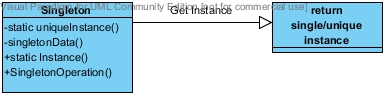

#Създаващи шаблони - Сингълтън (Singleton)
	1. ##Мотивация:
		Идеята на шаблона Сингълтън е да гарантира, че даден клас ще има една единствена инстанция за цялото приложение с ясно дефинирана точка за достъп. 
		Употребата на Сингълтъп е подходяща когато:
		- Искаме да имаме една единствена инстанция на даден клас.
		- Искаме тази инстанция да е видима и използваема от клиентите на приложението.
		Предимствата от употребата на Сингълтън са няколко:
		- Контрол на достъпа до въпросната инстанция (дори и когато имаме многонишкова среда).
		- Не замърсяваме глобалното пространство на имената в приложението.
		- Сингълтън може да се наследява.
		Потенциални проблеми:
		- Осигуряването на единствена инстанция в многонишкова среда в зависимост от конкретния език за програмиране. 
	
	2. ##Структура:
		
	
	3. ##Имплементация:
		Има множество примери за ситуации, в които бихме искали да си гарантираме единствена променлива от даден клас:
		- Бихме искали да имаме единствена инстанция на клас отговорен за създаването на журнали в дадено приложение.
		- В дадено приложение може да имаме множество услуги и модули разчитащи на наличните принтери, но ще искаме да имаме единствена точка за достъп до тези ресурси.
	
	4. ##Примерен код:
	```
	public class Singleton 
	{
		private static Singleton instance;
		protected Singleton() { }
		public static Singleton Instance() 
		{			
			if (instance == null) 
			{
				instance = new Singleton();
			}
			
			return instance;
		}
	}
	```